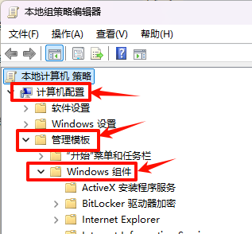
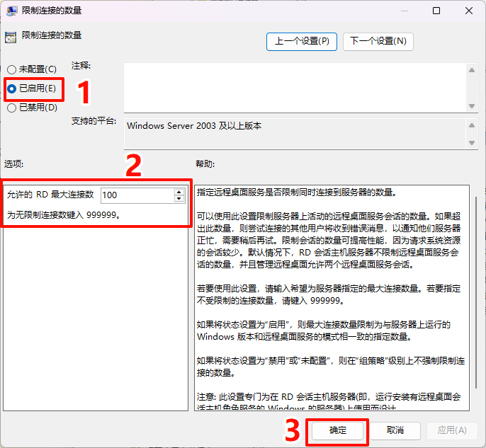

# windows11开启远程桌面多访问本机教程

此教程基于以下2025年07月13日时 windows11 版本。

## 0.前置条件

下载最新的 [RDPWrap Release](https://github.com/stascorp/rdpwrap/releases)

下载最新配置文件 [rdpwrap.ini](https://raw.githubusercontent.com/sebaxakerhtc/rdpwrap.ini/master/rdpwrap.ini)，并命名文件内容为 ` rdpwrap.ini` 。

## 1.设置远程桌面连接

按下 `win` 键进入设置，搜索“远程桌面”并开启。

如果没有找到，说明您的Windows系统版本为家庭版，缺少该功能。自行搜索“**Windows家庭版开启远程桌面**”。

## 2.创建用户并配置远程登录权限

按下 `win` 键进入设置，搜索“其他用户”并添加用户。

创建完成后，点击“更改账户类型”，设置为“管理员”。

`win+r` 输入 `lusrmgr.msc` 回车，点击“用户”，找到刚才创建的用户并双击，把“密码永不过期”打上勾，确认。

根据下列步骤配置新建用户远程登录权限。

## 3.配置多用户登录

`win+r` 输入 `gpedit.msc` 回车，依次点击**计算机配置》管理模板》windows组件》远程桌面服务》远程桌面会话主机》连接**。

按下图依次1-3点击，并依次设置4、5、6三项。

- 修改完成后需要刷新组策略，右键管理员打开 `cmd` 或者 `powershell`，输入 `gpupdate /force` ，刷新完成后即可关闭命令行。

## 4.多用户登录补丁

**NOTE**：如果您使用的是 **Windows 服务器版**，您可以直接跳过这一步。

> Windows 10/11就算打开了远程桌面，修改了限制链接数但还是只能1个账号远程登陆(本地自己连自己=2个账号)，所以需要破解，推荐使用 `RDPWrap` (本人使用 [SuperRDP2](https://github.com/anhkgg/SuperRDP) 没有成功)。

1. 打开下载的压缩包 `RDPWrap.zip`（版本号不要求）并解压，右键管理员运行 `install.bat` 。

2. 双击运行 `RDPConf.exe` 。

   

3. 查看右上角，如果显示红色的 `[not supported]`，先关闭 RDPConf, 再用下载的 `rdpwrap.ini` 覆盖 `C:\Program Files\RDP Wrapper\rdpwrap.ini` 。

4. 不用重启电脑，重新运行 `RDPConf.exe` ，此时右上角应该显示绿色的 `[fully supported]` 。

> 如果配置不成功，将出现以下错误。
>
> 

## 5.远程登录本机

任务栏搜索“远程桌面连接”，打开并输入 `127.0.0.2` 和新建的用户、密码。

RDP协议无法让你自由灵活的转动视角，如果你发现鼠标转不动属于正常现象。

## 参考

1. [远程本地多用户桌面1.3(一种不让电脑跟你抢键鼠的思路)](https://www.bilibili.com/opus/805995851989123075)
2. [win10 LTSC 2021 开启多用户 RDP 远程登录](https://blog.sena.moe/win10-multiple-RDP/)
